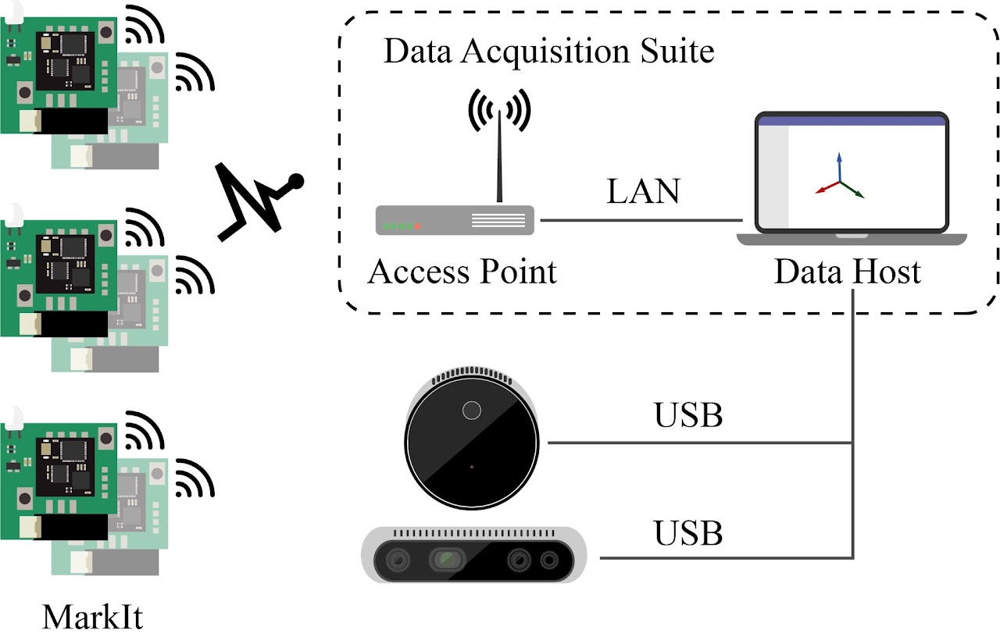
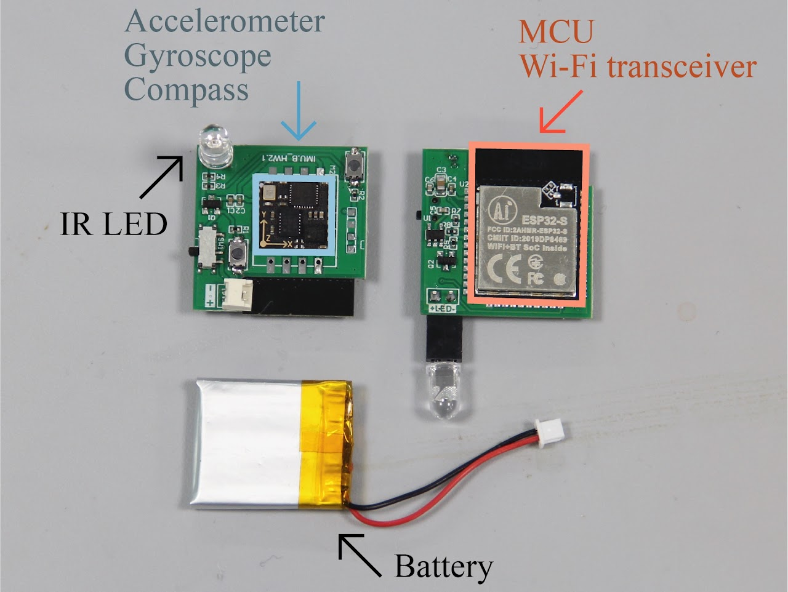

# RFMarkIt Firmware

This is the firmware for RFMarkIt project, which is a project for a active marker system for motion capture / 6DOF tracking.





For more details, visit [our website](https://sites.google.com/view/markit-virat/home)

## Get Started

First, setup esp-idf environment(v4.4.4) according to the official guide [here](https://docs.espressif.com/projects/esp-idf/zh_CN/v4.4.4/esp32/get-started/)

Now, you need to choose from hardware v1.0 and v2.0. v1.0 uses esp32 and hi229, while v2.0 uses esp32s3 and bno085

```shell
make set_hardware_v1
make set_hardware_v2
```

If you want to change other settings (e.g. use linear acceleration), you can run `idf.py menuconfig` in the project root directory.

```shell
idf.py menuconfig
```

```shell

Then, build the project by running `idf.py build` in the project root directory.

```shell
idf.py build
```

To flash an node, run `idf.py flash monitor` in the project root directory.

```shell
idf.py -p <PORT> flash monitor
```

## Developers' Guide

The project is organized as follows:

- `components` system components
    - `components/apps` applications that runs with RTOS
    - `components/ble` Bluetooth Low Energy(BLE) components
    - `components/blink` functions to operate LED
    - `components/imu` imu interface
    - `components/rest_controller` RESTful API controller
    - `components/sys` supporting modules for system
- `docs` documents
- `include` global headers
- `lib` common libraries
    - `lib/battery` battery
    - `lib/bno085` bno085 library
    - `lib/hi229` hi229 library
    - `lib/libtcp` tcp library
    - `lib/libudp` udp library
    - `lib/ring_buf` ring buffer library
    - `lib/spatial` spatial math library
- `main` entrypoint of firmware
- `scripts` helper scripts
- `tests` function tests

## Operators' Guide

The detailed guide can be found in [docs/manual.md](docs/manual.md)

### List of API

The API can be used against `http://<UNIT_IP>:18888/` endpiont

| NEW API           | PATH                    | Type            | Function                                                 |
|-------------------|-------------------------|-----------------|----------------------------------------------------------|
| system_info       | /v1/system/info         | `[get]       `  | ping,id,ver,time                                         |
| system_power      | /v1/system/power        | `[post]      `  | restart, shutdown, #version_shutdown                     |
| system_upgrade    | /v1/system/upgrade      | `[get\|post]  ` | update                                                   |
| system_selftest   | /v1/system/selftest     | `[post]      `  | self_test                                                |
| system_power_mgmt | /v1/system/power_mgmt   | `[post]      `  | always_on, cancel_always_on                              |
| nvs_variable      | /v1/nvs/variable/<name> | `[get\|post]  ` | varset,varget                                            |
| imu_calibrate     | /v1/imu/calibrate       | `[post]      `  | imu_cali_reset, imu_cali_acc, imu_cali_mag               |
| imu_toggle        | /v1/imu/toggle          | `[post]      `  | imu_enable,imu_disable,                                  |
| imu_status        | /v1/imu/status          | `[get]       `  | imu_status imu_imm                                       |
| imu_debug_toggle  | /v1/imu/debug/toggle    | `[post]      `  | toggle debug mode and disconnect monitor                 |
| imu_debug_socket  | /v1/imu/debug/socket    | `[ws]        `  | imu_debug imu_setup                                      |
| blink_configure   | /v1/blink/configure     | `[get\|post]  ` | blink_set, blink_get, auto/manual                        |
| blink_toggle      | /v1/blink/toggle        | `[get\|post]  ` | blink_start, blink_stop, blink_mute, also get led status |
| operation_mode    | /v1/operation/mode      | `[get\|post]  ` | start stop                                               |

